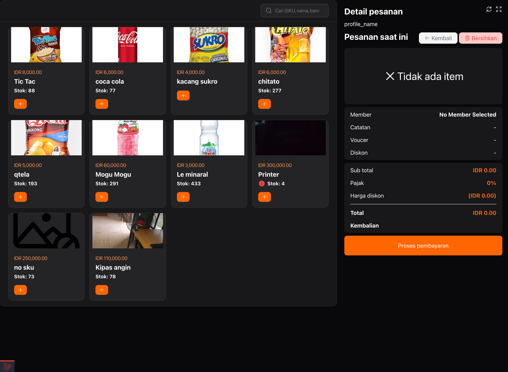
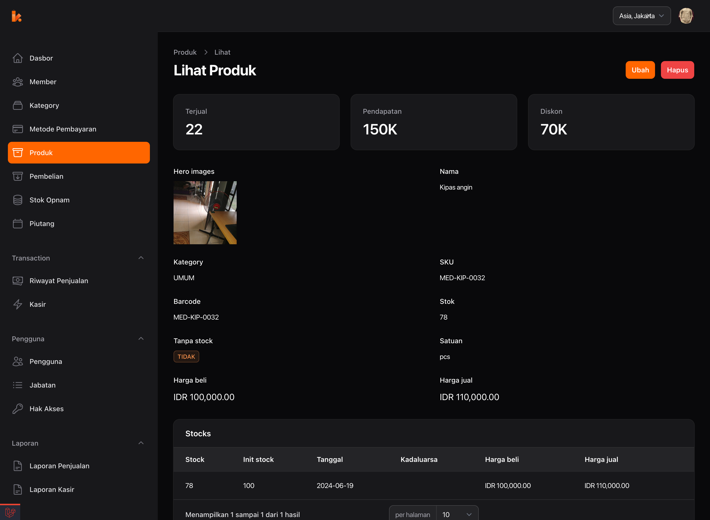

  <h1>Nonci Web App</h1>

  
 Nonci is a Point of Sale (POS) application built using Laravel for the API, the Filament admin panel for the web application, and Flutter for the mobile application. 

  

## Requirements
* php 8.1
* mysql 5.7 or higher
* php-ext.* base on laravel extenstion requirement

## Features
- **Role Management**: Define roles and permissions for users.
- **Transaction Management**: Handle sales transactions seamlessly.
- **Product Management**: Manage your inventory and products effectively.
- **Unit Price**: The product will have a different price base on the basic unit.
- **Discount**: You can sell the product with a discount per item or global discount.
- **Purchasing**: Manage purchase orders and supplier relationships.
- **Stock Opname**: Conduct stock taking and inventory audits to ensure accuracy.
- **Receivable Management**: Track and manage receivables owed by and to your business.
- **Payment Method Management**: Define and manage various payment methods.
- **Voucher Management**: Create, distribute, and track the usage of vouchers.
- **Reporting**: Generate reports for insights into sales and performance.
- **Simple Accounting**: Basic accounting features to track income, expenses, and profits.
- **Real-time Dashboard**: Monitor business metrics and performance in real-time.
- **Web usb direct printing**: support the thermal printer using usb feature from browser (Chrome, Firefox)
- **Barcode support**: we can use the barcode on stock opname, purchasing, and POS feature

## Screenshots

  
  &emsp;
    

<!--  -->

## Technologies Used
* **Backend**: [Laravel](https://laravel.com)
* **Frontend** (Web): [Filament Admin Panel](https://filamentphp.com)
* **Frontend** (Mobile): [Flutter](https://flutter.github.io)

## Installation
1. Clone the repository: git clone https://github.com/Nonci/Nonci.git
2. Navigate to the project directory: cd Nonci
3. Install dependencies:
4. Laravel:
   * `composer install`
   * `cp .env.example .env`
   * edit the env based on your local configuration
   * `php artisan key:generate`
   * `php artisan migrate --path=database/migrations/tenant --seed`
   * `php artisan filament:assets`
   * `php artisan livewire:publish --assets`
5. Javascript:
  * `npm install`
  * `npm run build or npm run dev`
6. Create the user using `php artisan app:create-user`

